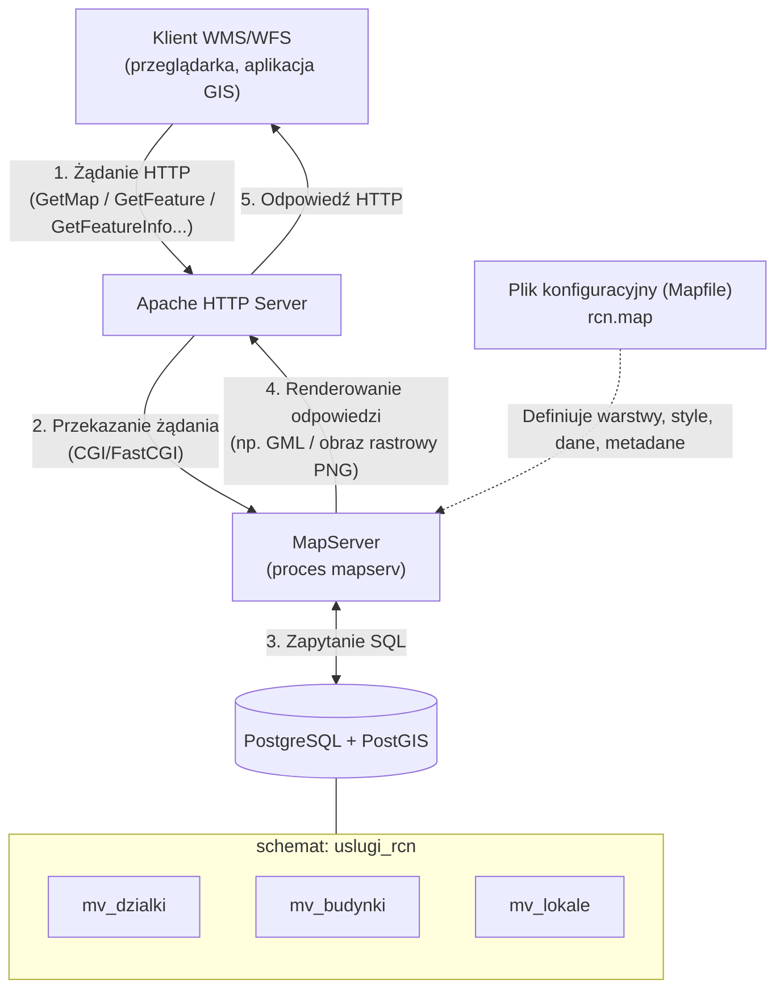

# Konfiguracja Usługi WMS/WFS Rejestru Cen Nieruchomości (RCN)

Dokument zawierający zestaw kroków do uruchomienia przykładowej powiatowej usługi WMS/WFS RCN za pomocą narzędzi OpenSource MapServer, Apache HTTP Server skierowany dla administratora środowiska Linux Debian.  

---

## 1. Wymagania środowiskowe

| Komponent | Wersja (testowana) | Uwagi |
|---|---|---|
| System operacyjny | Debian Trixie 13.6 | |
| MapServer | 8.6.5 | wymagana obsługa PostGIS (`INPUT=POSTGIS`) |
| Apache | 2.4.68 | z modułami `cgid`, `fcgid`, `rewrite` |
| GDAL | 3.10 | pakiet `gdal-bin` |
| PostgreSQL | 18 | może działać na osobnym hoście |
| PostGIS | 3.6 | rozszerzenie bazy PostgreSQL |

---

## 2. Architektura rozwiązania i przepływ danych



### Opis przepływu

1. Klient HTTP wysyła żądanie WMS lub WFS do endpointu usługi (`http://host/cgi-bin/mapserv[.fcgi]/rcn`), np. `GetCapabilities`, `GetMap`, `GetFeatureInfo`, `GetFeature`.
2. Apache przekazuje żądanie do procesu MapServer ([CGI](https://mapserver.org/cgi/index.html) lub [FastCGI](https://mapserver.org/optimization/fastcgi.html)).
3. MapServer odczytuje konfigurację z pliku `rcn.map`, łączy się z PostGIS i generuje odpowiedź zgodnie z parametrami żądania (np. obraz PNG dla `GetMap`, GML dla `GetFeature`, XML dla `GetFeatureInfo` - zależnie od konfiguracji i parametrów zapytania).
4. Odpowiedź wraca przez Apache do klienta.

---

## 3. Instalacja pakietów

MapServer 8.6.x dostępny jest w repozytorium `trixie-backports`. Należy je najpierw dodać.

```bash
# Dodanie repozytorium trixie-backports
sudo tee /etc/apt/sources.list.d/trixie-backports.sources > /dev/null <<'EOF'
Types: deb
URIs: http://deb.debian.org/debian
Suites: trixie-backports
Components: main
Signed-By: /usr/share/keyrings/debian-archive-keyring.gpg
EOF

sudo apt update
sudo apt upgrade -y

# Pakiety z głównego repozytorium
sudo apt install -y \
    apache2 \
    libapache2-mod-fcgid \
    gdal-bin \
    curl \
    nano
    

# MapServer z backports
sudo apt install -y -t trixie-backports \
    mapserver-bin \
    cgi-mapserver
```

### Weryfikacja instalacji

1. Weryfikacja serwera Apache HTTP:

   ```bash
   curl -i http://localhost
   ```
   
   Odpowiedź powinna zawierać nagłówek `HTTP/1.1 200 OK` oraz kod HTML strony. 
   Działanie serwera warto również potwierdzić z poziomu przeglądarki internetowej. Wpisując w pasku adresu `http://IP_MASZYNY`, powinna wyświetlić się domyślna strona powitalna *Apache2 Debian Default Page*.

2. Weryfikacja MapServera:

   ```bash
   mapserv -v
   ```

   Wynik musi zawierać flagi: `INPUT=POSTGIS` `SUPPORTS=PROJ` `SUPPORTS=WMS_SERVER` `SUPPORTS=WFS_SERVER` `OUTPUT=PNG`.

---

## 4. Przygotowanie katalogu wdrożeniowego

Wszystkie pliki należy umieścić w katalogu `/opt/gugik/mapserver/rcn` - poza document root serwera WWW, dostępnym do odczytu dla procesu serwera WWW. Mapfile (rcn.map) może zawierać dane dostępowe do bazy danych - nie może być dostępny bezpośrednio przez przeglądarkę.

> **Przed rozpoczęciem:** Należy upewnić się, że pobrano repozytorium całego projektu do katalogu domowego

```bash
# Utworzenie katalogu docelowego
sudo mkdir -p /opt/gugik/mapserver/rcn
sudo cp -r ~/RCN/3-konfiguracja-uslugi/setup-deb/* /opt/gugik/mapserver/rcn/

sudo chown -R root:www-data /opt/gugik/mapserver/rcn
sudo chmod -R u=rwX,g=rX,o= /opt/gugik/mapserver/rcn

# Podkatalog logów MapServera
sudo mkdir -p /opt/gugik/mapserver/rcn/logs
sudo chown www-data:www-data /opt/gugik/mapserver/rcn/logs
sudo chmod 770 /opt/gugik/mapserver/rcn/logs
```

### Zawartość katalogu wdrożeniowego

<pre>
/opt/gugik/mapserver/rcn/
├── rcn.map                  # plik konfiguracyjny usługi MapServera
├── common_md.inc            # wspólne definicje metadanych GML (dołączane w rcn.map)
├── Fontset.txt              # rejestr czcionek MapServera
├── arial.ttf                # czcionka TrueType (etykiety warstw)
├── header.xml               # otwierający tag XML odpowiedzi GetFeatureInfo
├── footer.xml               # zamykający tag XML odpowiedzi GetFeatureInfo
├── common_gfi.xml           # wspólne pola wyników (dołączane w szablonach warstw)
├── rcn_dzialki.xml          # szablon wyników – warstwa działek
├── rcn_budynki.xml          # szablon wyników – warstwa budynków
├── rcn_lokale.xml           # szablon wyników – warstwa lokali
└── logs/                    # podkatalog logów MapServera (do utworzenia)
</pre>

---

## 5. Konfiguracja

### 5.1 Edycja `rcn.map`

Przed konfiguracją serwera WWW należy uzupełnić wszystkie placeholdery w pliku `rcn.map` za pomocą dowolnego preferowanego edytora tekstu. W przykładzie wykorzystano `nano`. Parametry do uzupełnienia oznaczone są nawiasami kwadratowymi `[...]` oraz adekwatnymi komentarzami w treści pliku poprzedzonymi znakiem `#`.

```bash
sudo nano /opt/gugik/mapserver/rcn/rcn.map
```

Zbiorcza checklista parametrów do uzupełnienia dostępna jest w [sekcji 7](#7-checklista-wdrożeniowa) tego dokumentu.
Poniżej wymienione są one wg kolejności sekcji pliku `rcn.map` wraz z objaśnieniami.
> **UWAGA** - w rozdziale wymieniono **wyłącznie** parametry wymagające modyfikacji.

#### Parametry globalne - sekcja `MAP`

| Parametr | Opis | Wymagane działanie |
|---|---|---|
| `EXTENT` | Zasięg przestrzenny powiatu w EPSG:2180 | Zastąpić domyślny wartościami rzeczywistymi (`minx miny maxx maxy`) |

<a id="prg-extent"></a>

**Jak pobrać wartości dla parametrów EXTENT i "ows_extent" powiatu z PRG (WFS GUGiK)?**

Należy wyfiltrować właściwy powiat po 4-cyfrowym kodzie TERYT powiatu (`JPT_KOD_JE`) za pomocą polecenia `ogrinfo`. Poniżej przykład dla m. Tarnobrzeg (`WHERE JPT_KOD_JE='1864'`):

```bash
ogrinfo -q -dialect SQLite \
  -sql "SELECT ST_MinX(msGeometry) || ' ' || ST_MinY(msGeometry) || ' ' || ST_MaxX(msGeometry) || ' ' || ST_MaxY(msGeometry) AS bbox FROM 'A02_Granice_powiatow' WHERE JPT_KOD_JE='1864'" \
  "WFS:https://mapy.geoportal.gov.pl/wss/service/PZGIK/PRG/WFS/AdministrativeBoundaries" \
  2>/dev/null | grep bbox
```

Przykładowy wynik:
<pre>
bbox (String) = 684335.465185 297178.3974 697759.81489 313412.404953
</pre>
> Do pliku `rcn.map` należy skopiować wyłącznie wartość **po znaku `=`** (cztery liczby oddzielone spacjami).

#### Metadane usługi - sekcja `WEB.METADATA`
**<p align="center">Parametry identyfikacyjne</p>**

| Parametr | Opis |
|---|---|
| `ows_title` | Pełna nazwa usługi, np. `Rejestr Cen Nieruchomości - Powiat X` |
| `ows_onlineresource` | Publiczny URL usługi *(uzupełnić i odkomentować przy publikacji)* |

**<p align="center">Parametry INSPIRE</p>**

| Parametr | Opis |
|---|---|
| `ows_inspire_mpoc_name` | Pełna nazwa urzędu |
| `ows_inspire_mpoc_email` | Oficjalny adres e-mail urzędu |
| `wms_inspire_resourcelocator` | Publiczny URL Capabilities usługi WMS *(uzupełnić i odkomentować przy publikacji)* |
| `wfs_inspire_resourcelocator` | Publiczny URL Capabilities usługi WFS *(uzupełnić i odkomentować przy publikacji)* |

**<p align="center">Dane kontaktowe urzędu</p>**

| Parametr | Opis |
|---|---|
| `ows_contactorganization` | Pełna nazwa urzędu |
| `ows_contactperson` | Imię i nazwisko osoby kontaktowej *(opcjonalne)* |
| `ows_stateorprovince` | Województwo |
| `ows_address` | Ulica i numer |
| `ows_city` | Miejscowość |
| `ows_postcode` | Kod pocztowy (format XX-XXX) |
| `ows_contactelectronicmailaddress` | E-mail urzędu |
| `ows_contactvoicetelephone` | Numer telefonu |
| `ows_hoursofservice` | Godziny pracy, np. `7:30-15:30` |

**<p align="center">Atrybucja (opcjonalna - można usunąć z pliku)</p>**

| Parametr | Opis |
|---|---|
| `wms_attribution_title` | Nazwa powiatu |
| `wms_attribution_onlineresource` | URL strony starostwa lub geoportalu powiatowego |
| `wms_attribution_logourl_href` | URL herbu powiatu (PNG) |


#### Warstwy - sekcje LAYER

Usługa publikuje trzy warstwy z widoków zmaterializowanych w schemacie `uslugi_rcn`:

| Warstwa | Typ geometrii | Widok PostgreSQL | Widoczność |
|---|---|---|---|
| `dzialki` | POLYGON | `uslugi_rcn.mv_dzialki` | do skali 1:5 000 (etykiety do 1:2 000) |
| `budynki` | POLYGON | `uslugi_rcn.mv_budynki` | do skali 1:2 000 |
| `lokale` | POINT | `uslugi_rcn.mv_lokale` | do skali 1:2 000 |

Wszystkie warstwy używają kolumny geometrii `geom` i układu SRID=2180.

**<p align="center">Połączenie z bazą danych - parametr `CONNECTION`</p>**

W każdej warstwie należy uzupełnić parametry połączenia:

```
CONNECTION "host=[ADRES_IP_BAZY_DANYCH] dbname=[NAZWA_BAZY_DANYCH] user=[UŻYTKOWNIK_BAZY_DANYCH] password=[HASŁO_UŻYTKOWNIKA_BAZY_DANYCH]"
```

| Parametr | Opis |
|---|---|
| `host` | Adres serwera PostgreSQL |
| `dbname` | Nazwa bazy danych zawierającej schemat `uslugi_rcn` |
| `user` | Użytkownik z uprawnieniami `CONNECT`, `USAGE` na schemat, `SELECT` na widoki zmaterializowane |
| `password` | Hasło użytkownika |

**<p align="center">Zasięgi przestrzenne warstw - `EXTENT` i `ows_extent`</p>**

W każdej warstwie należy ustawić zasięg przestrzenny w dwóch miejscach:

```text
EXTENT <minx> <miny> <maxx> <maxy>             # w dyrektywie LAYER
"ows_extent" "<minx> <miny> <maxx> <maxy>"     # w sekcji LAYER.METADATA
```

Obie wartości muszą być spójne i wyrażone w metrach (EPSG:2180). Tak jak w [MAP.EXTENT](#prg-extent)

### 5.2 Szablony GetFeatureInfo (XML)
> **UWAGA** - w rozdziale jedynie omawiane są szablony odpowiedzi GetFeatureInfo - nie wymagają one żadnej modyfikacji.

Mapfile deklaruje jeden format wyjściowy dla `GetFeatureInfo`:

| Format MIME | Pliki szablonów |
|---|---|
| `text/xml` | `rcn_{budynki,dzialki,lokale}.xml`, `common_gfi.xml` |

Łańcuch inkludowania XML:

<pre>
GetFeatureInfo
 ├── header.xml           ← &lt;GETFEATUREINFO&gt;
 ├── [resultset layer=budynki] → rcn_budynki.xml ─┐
 ├── [resultset layer=lokale]  → rcn_lokale.xml  ─┼─→ dołączają common_gfi.xml
 ├── [resultset layer=dzialki] → rcn_dzialki.xml ─┘
 └── footer.xml           ← &lt;/GETFEATUREINFO&gt;
</pre>

Atrybuty eksponowane w szablonach:
- wspólne pola (m.in. `tran_*`, `dok_*`, `nier_*`) znajdują się w wydzielonym pliku `common_gfi.xml`, który jest dołączany w szablonach poszczególnych warstw.
- specyficzne dla danej warstwy:

| Szablon | Atrybuty specyficzne |
|---|---|
| `rcn_dzialki` | `dzi_id_dzialki`, `dzi_nr_dzialki`, `dzi_przezn_wmpzp`, `dzi_pow_ewid`, `dzi_sposob_uzyt`, `dzi_cena_brutto`, `dzi_vat`, `dzi_info`, `dzi_adres` |
| `rcn_budynki` | `bud_id_budynku`, `bud_nr_budynku`, `bud_rodzaj`, `bud_pow_uzyt`, `bud_cena_brutto`, `bud_vat`, `bud_info`, `bud_adres` |
| `rcn_lokale` | `lok_id_lokalu`, `lok_nr_lokalu`, `lok_funkcja`, `lok_liczba_izb`, `lok_nr_kond`, `lok_pow_uzyt`, `lok_pow_przyn`, `lok_cena_brutto`, `lok_vat`, `lok_info`, `lok_adres` |

Każdy atrybut w szablonie odpowiada kolumnie w odpowiednim widoku zmaterializowanym.

### 5.3 Czcionki
> **UWAGA** - w rozdziale poruszone jest jedynie zagadnienie dot. czcionek dla usługi - nie wymagają one żadnej modyfikacji, powinny być dostępne zgodnie ze strukturą projektu.

Plik `Fontset.txt` rejestruje czcionki dostępne dla MapServera:

<pre>
arial	arial.ttf
</pre>

Czcionka `arial` jest używana przez warstwę `dzialki` (etykiety numerów działek) oraz `lokale` (etykieta literowa „L").

### 5.4 Konfiguracja MapServera i Apache
> **UWAGA** - w rozdziale znajdują się instrukcje do wykonania celem wstępnej konfiguracji MapServer oraz Apache HTTP do działania.
#### Konfiguracja MapServer - `mapserver.conf`

MapServer 8.x wymaga pliku `mapserver.conf`, który centralnie zarządza m.in. dozwolonymi ścieżkami do plików Mapfile. Poniższa konfiguracja ma za zadanie:

*   **Ustawienie domyślnej usługi:** Wskazanie domyślnego pliku Mapfile za pomocą parametru `MS_MAPFILE`.
*   **Ograniczenie dostępu:** Wymuszenie obsługi wyłącznie tych usług, które zostały jawnie zdefiniowane w konfiguracji (flaga `MS_MAP_NO_PATH`), oraz przypisanie bezpiecznego aliasu `RCN` do fizycznej ścieżki wdrażanej usługi w bloku `MAPS`.

> **Przydatne linki do dokumentacji:**
> * [Plik konfiguracyjny (CONFIG)](https://mapserver.org/mapfile/config.html)
> * [Zmienne środowiskowe MapServera](https://mapserver.org/optimization/environment_variables.html)

```bash
# Utworzenie pliku CONFIG dla MapServera
sudo mkdir -p /etc/mapserver
sudo tee /etc/mapserver/mapserver.conf > /dev/null <<'EOF'
CONFIG
  ENV
    MS_MAPFILE "/opt/gugik/mapserver/rcn/rcn.map"
    MS_MAP_NO_PATH "1"
  END

  MAPS
    RCN "/opt/gugik/mapserver/rcn/rcn.map"
  END
END
EOF

sudo chmod 640 /etc/mapserver/mapserver.conf
sudo chown root:www-data /etc/mapserver/mapserver.conf

# Włączenie modułów Apache i restart
sudo a2enmod cgid fcgid rewrite
sudo service apache2 restart

# Dowiązanie symboliczne dla FastCGI
sudo ln -s $(which mapserv) /usr/lib/cgi-bin/mapserv.fcgi
```

#### Konfiguracja Apache - `mapserver-apache.conf`

Konfiguracja definiuje:
- zmienną `MAPSERVER_CONFIG_FILE` wskazującą na `mapserver.conf`,
- timeout żądań HTTP oraz operacji FastCGI,
- regułę `RewriteEngine` automatycznie wstawiającą `FEATURE_COUNT=1000` do żądań `GetFeatureInfo`, które nie zawierają tego parametru.

```bash
# Utworzenie konfiguracji Apache
sudo tee /etc/apache2/conf-available/mapserver-apache.conf > /dev/null << 'EOF'
SetEnv MAPSERVER_CONFIG_FILE "/etc/mapserver/mapserver.conf"
Timeout 300

<Directory "/usr/lib/cgi-bin">
    RewriteEngine On
    RewriteCond %{QUERY_STRING} \bREQUEST=GetFeatureInfo\b [NC]
    RewriteCond %{QUERY_STRING} !\bFEATURE_COUNT= [NC]
    RewriteRule ^(mapserv(?:\.fcgi)?)(/[a-zA-Z0-9_-]+)?$ $1$2?FEATURE_COUNT=1000 [QSA,L]
</Directory>

<IfModule mod_fcgid.c>
    FcgidInitialEnv MAPSERVER_CONFIG_FILE "/etc/mapserver/mapserver.conf"
    FcgidMaxProcessesPerClass 30
    FcgidIOTimeout 300
</IfModule>
EOF

# Włączenie konfiguracji
sudo a2enconf mapserver-apache

# Weryfikacja składni konfiguracji
sudo apache2ctl configtest

# Przeładowanie usługi (wykonać, jeśli powyższy test zwrócił "Syntax OK")
sudo service apache2 reload
```

> **UWAGA** - Powyższa konfiguracja zawiera najistotniejsze parametry i używa wartości domyślnych modułów dla pozostałych ustawień. Powyższe wartości oraz pozostałe domyślne parametry mogą wymagać dostrojenia w zależności od zasobów środowiska uruchomieniowego i obciążenia usługi. W razie problemów z wydajnością należy zapoznać się z dokumentacją:
> - [mod_cgid](https://httpd.apache.org/docs/current/mod/mod_cgid.html)
> - [mod_fcgid](https://httpd.apache.org/mod_fcgid/mod/mod_fcgid.html)
>
> **Konfiguracja HTTPS (certyfikat SSL/TLS) nie jest objęta zakresem tego dokumentu.**

---

## 6. Weryfikacja i debugowanie

### Weryfikacja usługi WMS/WFS (GetCapabilities)

```bash
# CGI
curl -i "http://localhost/cgi-bin/mapserv/rcn?SERVICE=WMS&REQUEST=GetCapabilities"
curl -i "http://localhost/cgi-bin/mapserv/rcn?SERVICE=WFS&REQUEST=GetCapabilities"

# FastCGI
curl -i "http://localhost/cgi-bin/mapserv.fcgi/rcn?SERVICE=WMS&REQUEST=GetCapabilities"
curl -i "http://localhost/cgi-bin/mapserv.fcgi/rcn?SERVICE=WFS&REQUEST=GetCapabilities"

# Sprawdzenie procesów FastCGI w puli
pgrep -u www-data -l mapserv
```

Prawidłowa odpowiedź to dokument XML z opisem możliwości usługi. Powyższe komendy weryfikują działanie lokalnie - w środowisku produkcyjnym `localhost` należy zastąpić docelowym adresem serwera.

> **Przy publikacji usługi** należy w pliku `rcn.map` odkomentować i uzupełnić zakomentowane parametry URL sekcji `WEB.METADATA`:
> - `ows_onlineresource`
> - `wms_inspire_resourcelocator`
> - `wfs_inspire_resourcelocator`

### Weryfikacja połączenia z bazą danych (GetFeature)

Poprawny wynik `GetCapabilities` nie gwarantuje prawidłowego działania usługi, jeśli występuje problem z połączeniem do bazy danych PostGIS. Właściwa weryfikacja wymaga wysłania żądania pobierającego obiekty, np. za pomocą wywołania WFS `GetFeature`.

Należy przetestować pobranie po jednym obiekcie dla każdej z warstw z poziomu terminala:

```bash
curl -i "http://localhost/cgi-bin/mapserv.fcgi/rcn?SERVICE=WFS&REQUEST=GetFeature&VERSION=2.0.0&COUNT=1&TYPENAMES=dzialki"
curl -i "http://localhost/cgi-bin/mapserv.fcgi/rcn?SERVICE=WFS&REQUEST=GetFeature&VERSION=2.0.0&COUNT=1&TYPENAMES=budynki"
curl -i "http://localhost/cgi-bin/mapserv.fcgi/rcn?SERVICE=WFS&REQUEST=GetFeature&VERSION=2.0.0&COUNT=1&TYPENAMES=lokale"
```

Prawidłowa odpowiedź powinna zwrócić status HTTP `200 OK` oraz dokument GML zawierający pełne dane opisowe oraz geometrię jednego obiektu z wybranej warstwy. Jeżeli serwer zwraca błąd `ServiceException` lub loguje błędy, należy sprawdzić poprawność hasła, uprawnień użytkownika do schematu `uslugi_rcn` oraz strukturę widoków w bazie.

### Rozwiązywanie problemów

Jeżeli usługa nie odpowiada, rzuca wyjątki, zwraca pusty obraz lub działa wyjątkowo powoli, administrator powinien:

1. Przeanalizować logi MapServera (`/opt/gugik/mapserver/rcn/logs/rcn_log.txt`). Dla bardziej szczegółowych informacji tymczasowo dodać dyrektywę `DEBUG [1-5]` w głównej sekcji `MAP` lub `LAYER` pliku `rcn.map`.
2. Sprawdzić logi Apache HTTP:
   ```bash
   sudo tail -f /var/log/apache2/error.log
   ```
3. Skorzystać z oficjalnych wytycznych:
   * [Ogólne zasady debugowania MapServera](https://mapserver.org/optimization/debugging.html)
   * [Debugowanie połączeń z bazą PostGIS](https://mapserver.org/optimization/vector.html#debugging-postgis)

---

## 7. Checklista wdrożeniowa

> W poniższej tabeli wymieniono **wyłącznie** parametry wymagające uzupełnienia. W pliku `rcn.map` oznaczone są one nawiasami kwadratowymi `[...]`.

| # | Sekcja w `rcn.map` | Parametr | Opis |
|---|---|---|---|
| 1 | `MAP` | `EXTENT` | Zasięg przestrzenny powiatu (EPSG:2180) |
| 2 | `WEB.METADATA` | `ows_title` | Nazwa usługi z nazwą powiatu |
| 3 | `WEB.METADATA` | `ows_onlineresource` | Publiczny URL usługi *(uzupełnić i odkomentować przy publikacji)* |
| 4 | `WEB.METADATA` | `ows_inspire_mpoc_name` | Pełna nazwa urzędu |
| 5 | `WEB.METADATA` | `ows_inspire_mpoc_email` | E-mail urzędu |
| 6 | `WEB.METADATA` | `wms_inspire_resourcelocator` | Publiczny URL Capabilities usługi WMS *(uzupełnić i odkomentować przy publikacji)* |
| 7 | `WEB.METADATA` | `wfs_inspire_resourcelocator` | Publiczny URL Capabilities usługi WFS *(uzupełnić i odkomentować przy publikacji)* |
| 8 | `WEB.METADATA` | `ows_contactorganization` | Pełna nazwa urzędu |
| 9 | `WEB.METADATA` | `ows_contactperson` | Imię i nazwisko osoby kontaktowej *(opcjonalne)* |
| 10 | `WEB.METADATA` | `ows_stateorprovince` | Województwo |
| 11 | `WEB.METADATA` | `ows_address` | Ulica i numer |
| 12 | `WEB.METADATA` | `ows_city` | Miejscowość |
| 13 | `WEB.METADATA` | `ows_postcode` | Kod pocztowy |
| 14 | `WEB.METADATA` | `ows_contactelectronicmailaddress` | E-mail urzędu |
| 15 | `WEB.METADATA` | `ows_contactvoicetelephone` | Numer telefonu |
| 16 | `WEB.METADATA` | `ows_hoursofservice` | Godziny pracy |
| 17 | `WEB.METADATA` | `wms_attribution_title` | Nazwa powiatu *(opcjonalne)* |
| 18 | `WEB.METADATA` | `wms_attribution_onlineresource` | URL strony starostwa *(opcjonalne)* |
| 19 | `WEB.METADATA` | `wms_attribution_logourl_href` | URL herbu powiatu *(opcjonalne)* |
| 20 | `LAYER` – dzialki | `CONNECTION` | Parametry połączenia PostgreSQL |
| 21 | `LAYER` – dzialki | `EXTENT` + `ows_extent` | Zasięg warstwy działek |
| 22 | `LAYER` – budynki | `CONNECTION` | Parametry połączenia PostgreSQL |
| 23 | `LAYER` – budynki | `EXTENT` + `ows_extent` | Zasięg warstwy budynków |
| 24 | `LAYER` – lokale | `CONNECTION` | Parametry połączenia PostgreSQL |
| 25 | `LAYER` – lokale | `EXTENT` + `ows_extent` | Zasięg warstwy lokali |

